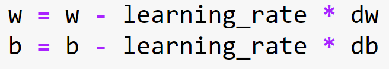

# Breast-Cancer-Detection
This project deals with binary classification by employing a supervised Learning technique called Logistic regression to predict whether a person has a breast cancer or not based on the fine needle aspirate (FNA) of a breast mass.

# ABSTRACT
Machine learning, since its inception has been trying to solve several real-world problems that hinder the progress in society. It has succeeded in many domains, medical field being one of the most successful domains where the use of machine learning has proven to be very effective and has become very vital.  This project is related to medical field and deals with binary classification by employing a supervised Learning technique called Logistic regression to predict whether a person has a breast cancer or not based on the fine needle aspirate (FNA) of a breast mass. This report records the training, validation and testing accuracy along with precision and recall for each. |

# Introduction

Logistic regression falls under the category of supervised learning that operates on discrete data. The Wisconsin cancer data set given for this project contains a set of 30 features along with a separate column that classifies if the patient has a cancer or not. The dataset is divided into 3 parts for training, validation and testing. The model is trained using the training dataset, validated immediately with the newly updated learnable parameters (weight and bias). With the finally calculated gradients, the accuracy of a trained model can be tested on a totally new subset of the data. The model, based on the patient&#39;s feature set would classify which class the patient belongs to; class 0 is benign and class 1 is malignant.

# Dataset

The Wisconsin dataset consist of 30 real valued input features which were computed from a digitized image of a Fine Needle Aspirate (FNA) of a breast mass.  The computed feature describes the following characteristics of the cell nuclei present in the image.

| S.NO | Characteristics of a cell Nuclei |
| --- | --- |
| 1 | Radius (mean of distances from center to points on the perimeter) |
| 2 | Texture (standard deviation of gray-scale values) |
| 3 | Perimeter |
| 4 | Area |
| 5 | Smoothness (local variation in radius lengths) |
| 6 | Compactness (perimeter2/area − 1.0) |
| 7 | Concavity (severity of concave portions of the contour) |
| 8 | Concave points (number of concave portions of the contour) |
| 9 | Symmetry |
| 10 | Fractal dimension (&quot;coastline approximation&quot; - 1) |

**Table 2.1 Tabulation of the Wisconsin dataset displaying the input features**

The mean, standard error, and &quot;worst&quot; or largest (mean of the three largest values) of these features were computed for each image, resulting in 30 features.

The dataset consists of 569 patient information. The dataset is divided into a set of three for training, validation and testing int the ratio of 8:1:1 respectively.

# Data preprocessing

The dataset provided to us consist of the ID, Diagnosis information along with 30 features of the patient.

1. The id of the patient is dropped because of its irrelevancy for training our model.
2. The diagnosis information of the patient provided as Malignant and Benign has been replaced with 1 and 0 respectively. This step is essential as this information in form of a matrix would be given as an input to the cost function and confusion matrix.
3. Each feature is normalized with min-max normalization which will convert each feature in the range of 0 to 1. Normalization is very useful in the cases where the feature is of different range. Having a different range might end up delaying the process of gradient descent as the weight and bias might take a lot of time to find a global minimum. Normalization also makes sure that if there are few data in the feature set that deviates to a greater than the normal, it doesn&#39;t vary the calculation of mean or standard deviation to a greater extent.
4. The normalized feature set and the diagnostic information is split into a set of 3, for training, validation and testing in the ratio of 8:1:1 respectively.
5. The transpose of each of the features along with the diagnosis information is calculated, this is useful while performing dot products with randomized weights.
6. The bias, weight, learning rate and epochs are initialized to a random value, the gradients are updated for each epoch while the hyper parameter is given by the user.

# Architecture

Training the logistic regression model involves finding out the global minimum of gradients (weight and bias) and improving the accuracy of the model by varying the hyper parameters (Epoch and Learning rate). The first step to calculate the logistic regression involves calculating the hypothesis function which is described in the image given below.

text: 
 
**Figure 5.1 Hypothesis function that limits the output of loss equation between 0 and 1**

The first step involves multiplying randomized weight matrix with the features and adding it to the bias. The resulting matrix is then passed to the **Sigmoid function**. Sigmoid function is given by the equation.

 text: 

**Figure 5.2 Formula of the Sigmoid function**

The sigmoid function converts the real valued data **Z** in the range of 0 to 1. In the case of cancer classification, the output value of the sigmoid function would be helpful to determine whether a cancer is malignant or benign based on decision boundary.

 text: 

**Figure 5.3 Output of the sigmoid function with respect to the decision boundary**

The performance of the classification model is determined using Cross-Entropy or a Cost function. This function works with values between 0 and 1. The output of the cost function is a single value. The Cost equation J(θ) is given below equation.

 text: 

**Figure 5.4 Cost equation for convergence of gradients**

The forward propagation ends with the calculation of cross entropy. The gradients (weights and bias) have to be updated for the next epoch and the equation to update the weights and bias is given below,

 text: 

**Figure 5.5 Equation to update the weights and biases.**

The **dw** and **db** in the equation stands for derivative weight and derivative bias.

 text: 

**Figure 5.6 Equation to calculate the derivative bases and derivative weights**

The derivative weight (dw) is calculated by taking the dot product of input feature matrix and the difference of hypothesis function and output matrix and finding their mean.

The derivative bias (db) is calculated by taking the mean of difference between the hypothesis function and the output matrix. The equations to calculate the dw and db are given below.

The gradients are updated and the forward propagation takes place for the validation dataset. The updated values of the gradients are then passed to the forward propagation of the training set again for epoch number of times.

Finally, the precision, recall and f-measure are calculated using the confusion matrix which takes the actual test outputs and predicted outputs as its parameters and provides performance measure in terms of accuracy, recall and precision.

The formulas to calculate Accuracy, Recall and f-measure is given below.

 text: 

**Figure 5.7 Formula to calculate Accuracy, Recall and Precision from a confusion matrix**

When the final gradients are obtained they are then tested on an unseen testing dataset and the accuracy is calculated. The hyper parameters are tuned until higher accuracy is obtained for the model.

# Result

The hyperparameters (learning rate and epochs) were tuned to find the best model. The graphs below show training accuracy, training cost, validation accuracy and validation cost along with their Accuracy precision, recall and f-measure.

1. 1) **For an epoch of 4100 and a learning rate of 0.78**

 text: 

**Figure 6.1 (A) and (B) Figures representing Accuracy vs Epoch and Cost vs Epoch for epoch of 4100 and learning rate of 0.78**

|

| Test Accuracy | Precision | Recall | f-Measure |
| --- | --- | --- | --- |
| 96.49% | 93% | 100% | 96% |
| --- | --- | --- | --- |

   **Table 6.2 Representing the test accuracy, precision, recall and f-measure calculated from the predicted values for the epoch of 4100 and learning rate of 0.78** |         |   |   |   |   |   |
| --- | --- | --- | --- | --- | --- | --- |
|

| **Epochs** | **Convergence of cost** |
| --- | --- |
| Cost at 0 epochs | 0.692156 |
| Cost at 1200 epochs | 0.103530 |
| Cost at 2400 epochs | 0.084981 |
| Cost at 3600 epochs | 0.076571 |

   **Table 6.3 Representing the convergence of cost for the epoch of 4100 and learning rate of 0.78**     |   |   |   |   |    |   |

1. 2) **For an epoch of 7500 and a learning rate of 0.054**

 text: 

**Figure 6.4 (A) and (B) Figures representing Accuracy vs Epoch and Cost vs Epoch for epoch of 7500 and learning rate of 0.054**

| Test Accuracy | Precision | Recall | f-Measure |
| --- | --- | --- | --- |
| 92.98% | 90% | 96% | 93% |

**Table 6.5 Representing the test accuracy, precision, recall and f-measure calculated from the predicted values for the epoch of 7500 and learning rate of 0.054**

|

| **Epochs** | **Convergence of cost** |
| --- | --- |
| Cost at 0 epochs | 0.692601 |
| --- | --- |
| Cost at 1200 epochs | 0.263673 |
| --- | --- |
| Cost at 2400 epochs | 0.203133 |
| --- | --- |
| Cost at 3600 epochs        | 0.175513 |
| --- | --- |
| Cost at 4800 epochs        | 0.158583 |
| --- | --- |
| Cost at 3600 epochs        | 0.146742 |
| --- | --- |
| Cost at 3600 epochs        | 0.137830 |
| --- | --- |

   **Table 6.6 Representing the convergence of cost for the epoch of 7500 and learning rate of 0.054** |
| --- |

1. 3) **For an epoch of 5000 and a learning rate of 0.1**

 text: 

**Figure 6.7 (A) and (B) Figures representing Accuracy vs Epoch and Cost vs Epoch for epoch of 5000 and learning rate of 0.1**

| Test Accuracy | Precision | Recall | f-Measure |
| --- | --- | --- | --- |
| 94.73% | 93% | 96% | 95% |

**Table 6.8 Representing the test accuracy, precision, recall and f-measure calculated from the predicted values for the epoch of 5000 and learning rate of 0.1**

|

| **Epochs** | **Convergence of cost** |
| --- | --- |
| Cost at 0 epochs | 0.693530 |
| --- | --- |
| Cost at 1200 epochs | 0.208896 |
| --- | --- |
| Cost at 2400 epochs | 0.162891 |
| --- | --- |
| Cost at 3600 epochs | 0.141495 |
| --- | --- |
| Cost at 4800 epochs | 0.128327 |
| --- | --- |

   **Table 6.9 Representing the convergence of cost for the epoch of 5000 and learning rate of 0.1**    |   |   |   |   |    |   |
| --- | --- | --- | --- | --- | --- | --- |

| **Learning rate** | **Epochs** | **Training accuracy**** In % **|** Validation accuracy ****In %**   | **Test accuracy**  **In %**   |
| --- | --- | --- | --- | --- |
| 0.01 | 4000 | 92.74725 | 96.49123 | 92.98246 |
| 0.01 | 5000 | 93.40659 | 96.49123 | 92.98246 |
| 0.01 | 5700 | 93.40659 | 96.49123 | 92.98246 |
| 0.01 | 6000 | 93.18681 | 96.49123 | 92.98246 |
| 0.2 | 5000 | 97.8022 | 98.24561 | 96.49123 |
| 0.2 | 6000 | 97.8022 | 98.24561 | 96.49123 |
| 0.24 | 7500 | 98.24176 | 98.24561 | 96.49123 |
| 0.27 | 7500 | 98.24176 | 98.24561 | 96.49123 |
| 0.3 | 7500 | 98.46154 | 98.24561 | 96.49123 |
| 0.34 | 5500 | 98.24176 | 98.24561 | 96.49123 |
| 0.6 | 5500 | 98.46154 | 98.24561 | 96.49123 |
| 0.6 | 6000 | 98.46154 | 98.24561 | 96.49123 |
| 0.55 | 6000 | 98.46154 | 98.24561 | 96.49123 |
|   |

**Table 6.10 Representing the test training accuracy, validation accuracy and test accuracy obtained by tuning the hyper parameters.**

# Conclusion

A highest accuracy of 96.5 percentage was achieved by this logistic regression model by tuning the hyperparameters and setting the value of learning rate to 0.2 and epoch to 5000. Thus, logistic regression is one of the effective supervised machine learning technique for two class classifier problem involving discrete data.

# References

[1] – Cost function in logistic regression - https://www.internalpointers.com/post/cost-function-logistic-regression

[2] – Introduction to logistic regression - https://towardsdatascience.com/introduction-to-logistic-regression-66248243c148

[3] – Beyond Accuracy: Precision and Recall - https://towardsdatascience.com/beyond-accuracy-precision-and-recall-3da06bea9f6c
